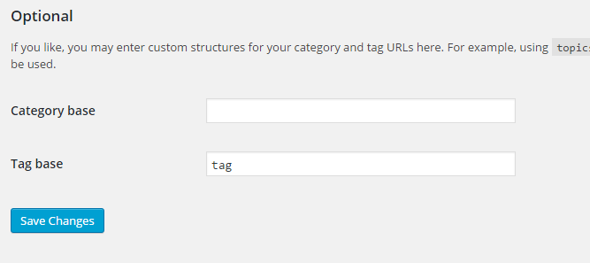

[](https://travis-ci.org/gios-asu/apiarium-wp-plugin) [](https://coveralls.io/github/gios-asu/apiarium-wp-plugin?branch=develop)

Television Screen and Kiosk WordPress Plugin

## Requirements

* WordPress 4.1+
* Composer

## Installation

#### Step 1: Get the plugin

You can either `git clone` this repo or download the [latest release as a ZIP](https://github.com/gios-asu/apiarium-wp-plugin/releases/latest).

#### Step 2: Put the plugin in your plugins folder

Put the unzipped folder into your `wp-plugins` or `plugins` directory

#### Step 3: Install the dependencies

You will need [Git](http://www.git-scm.com/) and [composer](https://getcomposer.org/doc/00-intro.md) in order to install the dependencies for this plugin.

Run `composer install --no-dev` in the root of the plugin, for example:

```sh
cd wp-plugins/apiarium-wp-plugin; composer install
```

#### Step 4: Activate the plugin

Activate on your WordPress dashboard. You should now have a tab on the dashboard menu labeled "Kiosk Settings"

#### Step 5 (Optional): Set up Twitter feeds

If you want to use Twitter feeds, you will need to add your Twitter API tokens to the Kiosk Settings tab.

#### Step 6 (Optional): Set up WordPress feeds

Note: If you are planning on using your own Wordpress feed to power the Kiosk,
you will need to make sure that the tag and category base urls are set:



## Shortcodes

The following shortcodes are available through this plugin

#### [display]

The display shortcode wraps your content and has an optional `theme` parameter.

```
[display theme=green]
  ...
[/display]
```

* theme (Optional)
    - green
    - blue

#### [display-row]

The `display-row` shortcode wraps your content to create a row of content. You can
use this shortcode to have many rows of content show up on the screen. The rows
will self-organize to all fit onto the screen at the same time. It has an optional
`size` parameter that helps determine how much of the screen the row should take up.

For example, if you have two `display-row`s next to each other, and one has a
`size` of `1` and the other, a `size` of `2`, the rows will take up the full
height of the screen, with a ratio of `1:2` between the rows. So the first row will
take up one-third of the screen and the second row will take up two-thirds of the screen.

```
[display-row size=1]
  ...
[/display-row]
```

* size (Optional)
   - numeric (1-inf)

#### [display-column]

The `display-column` shortcode behaves similarly to the `display-row` shortcode,
but splits the screen up into vertical columns.

```
[display-column size=1]
  ...
[/display-column]
```

* size (Optional)
   - numeric (1-inf)

#### [display-flex]

The `display-flex` shortcode will fill its container (either a `display-row` or
a `display-column`). Similarly to `display-row` and `display-column` it can also
have an optional `size` attribute.

```
[display-flex size=1]
  ...
[/display-flex]
```

* size (Optional)
   - numeric (1-inf)

#### [display-weather]

The `display-weather` shortcode will display a Yahoo weather widget. An optional
`iconset` can be provided.

```
[display-weather iconset="flat-weather"]
```

* iconset (Optional) defaults to `flat-weather`
    - "flat-weather"

#### [display-twitter]

The `display-twitter` shortcode will display a Twitter widget with tweets for the
required `search` parameter.

```
[display-twitter search="@asugreen"]
```

* search OR screenname (Required)
    - String

If you use `[display-twitter search="sustainability"]`, then tweets that contain "sustainability" will be displayed. If you use `[display-twitter screenname="sustainability"]`, then the Twitter user's timeline will be pulled.

#### [display-slider]

The `display-slider` shortcode will take RSS, XML, and JSON feeds and display them
in a Bootstrap slider! It supports ASU Now XML feeds, WordPress RSS feeds, and any
other type of RSS2 feed.

Put your feed links between the opening and closing shortcode tags, with a new line
in between each one.

```
[display-slider layout=newspaper content="heading,caption" limit=10 interval=5]
  https://asunow.asu.edu/feeds/renewable-energy
  https://asunow.asu.edu/feeds/sustainability%2Cglobal-institute-of
  https://asunow.asu.edu/feeds/sustainability%2Cschool-of
  https://asunow.asu.edu/feeds/sustainability
  https://asunow.asu.edu/feeds/sustainability-asu
[/display-slider]
```

* layout (Optional) defaults to `overlay`
    - overlay
    - newspaper
* content (Optional) defaults to `heading,caption,image`
    - Any of the following, separated by a comma:
        * heading
        * caption
        * image
        * html
* limit (Optional) defaults to 15
    - How many items to show in the slider
* interval (Optional) defaults to 5 seconds
    - How long to show each slide

## Example Page

Make a Page with the following text in it:

```
[display theme=green]
  [display-row]
    [display-column size=1]
      [display-flex size=1 classes=apiarium__no-border]
        
      [/display-flex]
      [display-flex size=2]
        [display-weather]
      [/display-flex]
      [display-flex size=3]
        <h2>Twitter</h2>
        [display-twitter search="@asugreen"]
      [/display-flex]
    [/display-column]
    [display-column size=2]
      [display-flex size=1 classes=apiarium__no-border]
        [display-slider content=image]
          https://wp.sustainability.dev.gios.asu.edu/?feed=events_rss2
        [/display-slider]
      [/display-flex]
    [/display-column]
    [display-column size=1]
      [display-flex size=1 classes=apiarium__no-border]
        [display-calendar]
      [/display-flex]
      [display-flex size=2]
        [display-slider content=heading,image]
          https://api.flickr.com/services/feeds/photos_public.gne?id=55424394@N03&lang=en-us&format=rss_200
        [/display-slider]
      [/display-flex]
      [display-flex size=3]
        <h2>ASU News</h2>
        [display-slider layout=newspaper content="heading,caption"]
          https://asunow.asu.edu/feeds/renewable-energy
          https://asunow.asu.edu/feeds/sustainability%2Cglobal-institute-of
          https://asunow.asu.edu/feeds/sustainability%2Cschool-of
          https://asunow.asu.edu/feeds/sustainability
          https://asunow.asu.edu/feeds/sustainability-asu
        [/display-slider]
      [/display-flex]
    [/display-column]
  [/display-row]
[/display]
```

* `/tag/test/feed/` will pull in posts from your blog with the `test` tag.


## Setting Up a Kiosk

We recommend using the Chrome Extension "Kiosk" by Zerbadog via the Extension Store.

## Development

Install using `composer install`.

Run tests using `vendor/bin/phpunit`.


## Additional Credits

Icons are provided thanks to [MerlinTheRed](http://merlinthered.deviantart.com/art/plain-weather-icons-157162192) under the Creative Commons Attribution-ShareAlike license.
